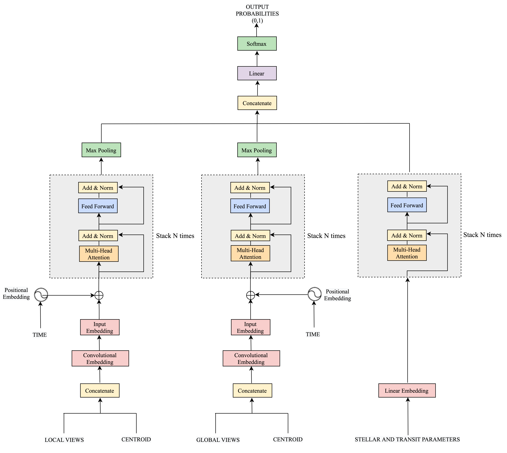

# A Transformer-based classification for planetary transit signals

The self-attention mechanism is an DL technique that attempts to mimic the action of selectively focusing on some relevant things while ignoring others. Models, such as the Transformer architecture [[1]](#1), were recently proposed for sequential data with successful results. This is an implementation to classify exoplanet transit signals using Deep Learning methods. 


This code contains the implementation of the model which contains three encoders. The general outline of the architecture is shown in the diagram below.


Diagram of the designed architecture:




The main module is in the `model.py file, which contains the modules needed to build each encoder. Each encoder works with the `EncoderBlock`  class.  This class calls the `MultiHeadedAttention` class implemented in `model.py`, but it is also possible to work with pytorch's own class (`nn.MultiheadAttention`). 

If you decide to work with pytorchs's class (`nn.MultiheadAttention`), the important is to modify the return so that it returns the attention weights. Also, change the return to obtain the weights of each head (in class `functional.py` from pytorch):

For example:

from:
```python 
return attn_output, attn_output_weights.sum(dim=1) / num_heads
```

to:
```python
return attn_output, attn_output_weights
```

or return no average attention weights over heads:

```python
if need_weights:
  attn_output_weights = attn_output_weights.view(bsz, num_heads, tgt_len, src_len)
  return attn_output, attn_output_weights
```


That's it, so you'll get the weights to do the head analysis of any model.

### File guide

`model.py`: creation of each component of the neural network. The encoders for each piece of information are implemented in this class.

`network.py`: In this class we instantiate the model and create complete neural network.

`attention_analysis.py`: calculation of the entropy of each layer and their heads

`positional_encoding.py`: creation of two types of positional encoding, one considers the $t$ of [[1]](#1) and the second considers the observation time $t_{time}$.

`mask.py`: file with methods for masking out the subsequent info. In our current implementation we don't use mask. In a future work we will implement different types of masks for different attention mechanisms. This in order to scale to longer sequences.


### Experiment

This implementation includes `experiment` parameter, which is linked to `commet.ml`. If you don't want to display the results via commet, you can comment or remove everything related to this variable, and just use the `logger`.

## Requirements

- Python 3.6.8
- Torch 1.8
- numpy 1.19
- commet_ml 3.8.1

## References
<a id="1"></a> 
Vaswani, A., Shazeer, N., Parmar, N., Uszkoreit, J., Jones, L., Gomez, A. N., ... & Polosukhin, I. (2017). Attention is all you need. Advances in neural information processing systems, 30..
